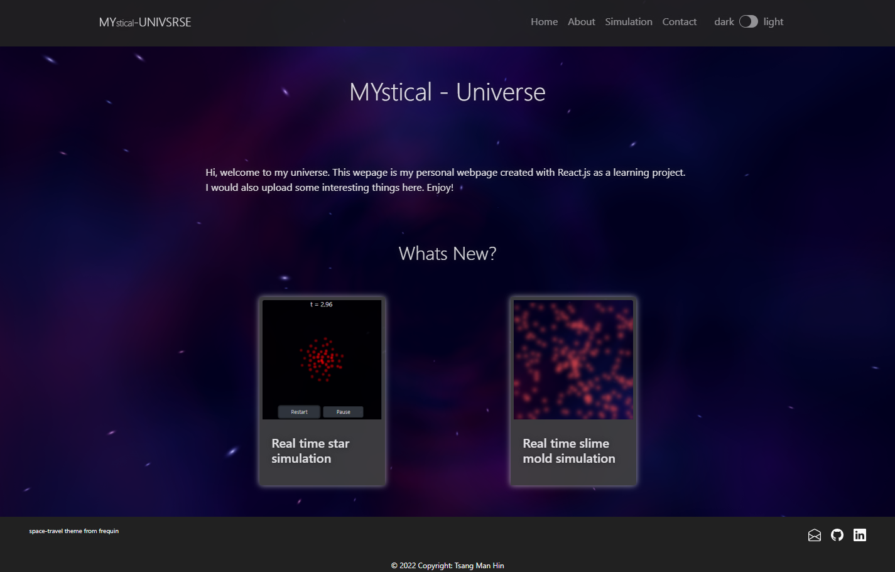

# Mystical-Universe



Mystical-Universe is a React.js app for my personal profile and sharing interesting stuffs.

## Directory Tree

```
.
├── App.css
├── App.jsx
├── components
│   ├── footer
│   │   ├── Footer.css
│   │   └── Footer.jsx
│   ├── header
│   │   ├── Header.css
│   │   └── Header.jsx
│   ├── index.jsx
│   ├── jumbotron
│   │   ├── Jumbotron.css
│   │   └── Jumbotron.jsx
│   ├── page
│   │   ├── Page.css
│   │   └── Page.jsx
│   ├── sandbox
│   │   ├── Sandbox.css
│   │   └── Sandbox.jsx
│   ├── slime
│   │   ├── Slime.css
│   │   ├── Slime.jsx
│   │   └── cell
│   │       ├── Cell.css
│   │       └── Cell.jsx
│   ├── sph
│   │   ├── SPH.css
│   │   ├── SPH.jsx
│   │   ├── particle
│   │   │   ├── Particle.css
│   │   │   └── Particle.jsx
│   │   └── physics.js
│   ├── subtitle
│   │   ├── SubTitle.css
│   │   └── SubTitle.jsx
│   └── themeProvider
│       ├── ThemeProvider.jsx
│       └── theme.js
├── hooks
│   ├── index.jsx
│   ├── useInterval.jsx
│   └── useScript.jsx
├── index.css
├── index.js
├── pages
│   ├── about
│   │   ├── About.css
│   │   └── About.jsx
│   ├── algorthm
│   │   ├── Algorithm.jsx
│   │   └── Algorthm.css
│   ├── contact
│   │   ├── Contact.css
│   │   └── Contact.jsx
│   ├── home
│   │   ├── Home.css
│   │   └── Home.jsx
│   ├── index.jsx
│   ├── notfound
│   │   └── NotFound.jsx
│   ├── profile
│   │   └── Profile.jsx
│   ├── research
│   │   └── Research.jsx
│   └── simulation
│       ├── Simulation.css
│       └── Simulation.jsx
└── tree.out
```


## License
[MIT](https://choosealicense.com/licenses/mit/)